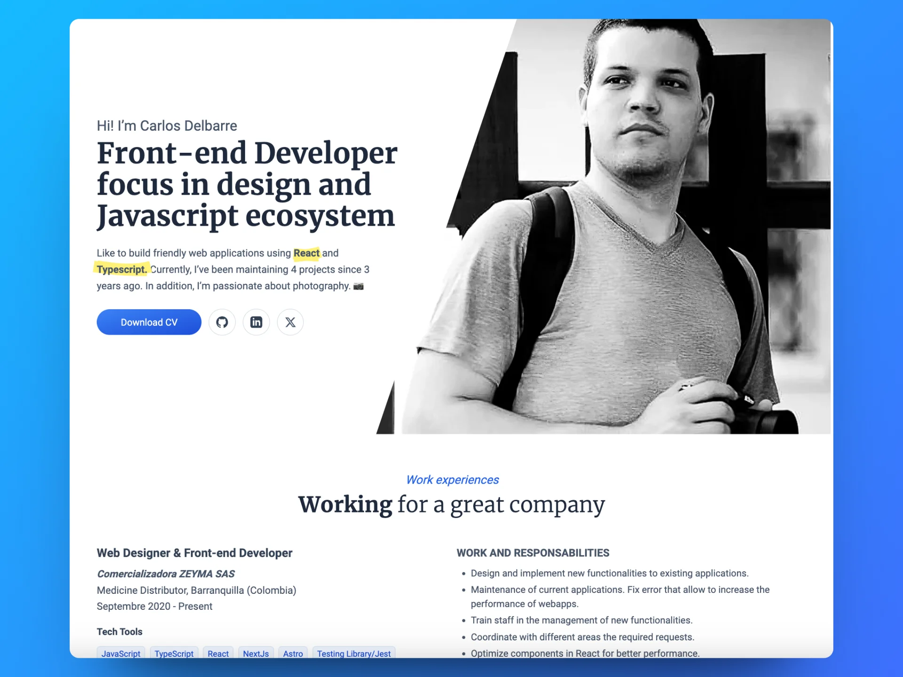

<div align="center">

<a href="https://www.cadelbarre.dev/" target="_blank">

</a>

</p>

<div align="center">
    <a href="https://cadelbarre.dev" target="_blank">
        Website
    </a>
    <span> - </span>
    <a href="#-getting-started">
        Getting Started
    </a>
    <span> - </span>
    <a href="#-stack">
        Stack
    </a>
    <span> - </span>
    <a href="https://x.com/cadelbarre" target="_blank">
        X
    </a>
</div>

</p>

[](https://nodejs.org/about/releases)

</div>

## Stack

- [**Astro**](https://astro.build/) 
- [**React 18.2**](https://react.dev/) 
- [**Tailwind CSS**](https://tailwindcss.com/)
- [**Iconoir**](https://iconoir.com/) 
- [**Fancybox**](https://fancyapps.com/) 
- [**Rough Notation**](https://roughnotation.com/) 

## Getting Started

We recommend using the following extensions for Visual Studio Code:

- [**Astro for VSCode**](https://marketplace.visualstudio.com/items?itemName=astro-build.astro-vscode).
- [**Tailwind CSS IntelliSense**](https://marketplace.visualstudio.com/items?itemName=bradlc.vscode-tailwindcss).

1. Clone the repository:

```bash
https://github.com/cadelbarre/portafolio.git 
```

2. Install dependencies:

```bash
npm install
# or
yarn install
# or
pnpm install
```

3. Run the development server:

```bash
npm run dev
# or
yarn dev
# or
pnpm dev
```

Open up [http://localhost:3000](http://localhost:3000) to view the website 🚀.

📁 Folder structure:

```
└── 📁 public
    └── 📁 assets
        └── 📁 images
            └── 📁 photography
            └── 📁 projects
        └── 📁 svg
    └── favicon.svg
    └── 📁 fonts
    └── 📁 pdfs

└── 📁 src
    └── env.d.ts
    └── 📁 features
        └── 📁 home
            └── experiencies.astro
            └── footer-action.astro
            └── footer-social.astro
            └── footer.astro
            └── hero-buttons.astro
            └── hero.astro
            └── project-article.astro
            └── projects.astro
            └── what-i-do.astro
    └── 📁 pages
        └── 404.astro
        └── index.astro
```

⚙ Commands:

| Command        | Action                                                  |
| :------------- | :------------------------------------------------------ |
| `dev`          | Starts local dev server at `localhost:3000`.            |
| `build`        | Build site to `./dist/`.                                |
| `preview`      | Preview your build locally, before deploying.           |
| `astro ...`    | Run Astro CLI commands like `astro add`, `astro check`. |
| `astro --help` | Get help using the Astro CLI.                           |
| `format`       | Format code with Prettier.                              |
